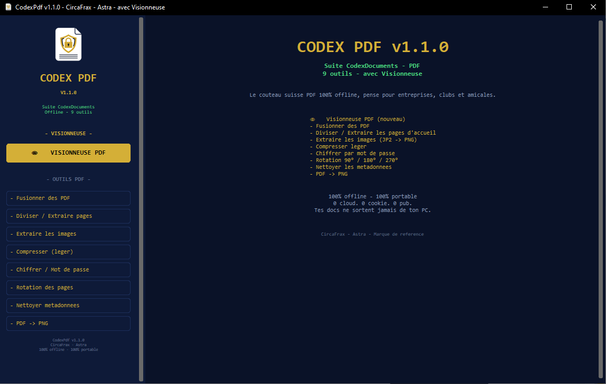

<p align="center">
  
</p>

# CodexPdf v1.1.1 - Le couteau suisse PDF 100% offline

<p align="center">
  
</p>

<p align="center">
  
  
  
  
</p>

<p align="center">

### ⬇️ [Télécharger CodexPdf v1.1.1 (Windows)](https://github.com/CircaFrax/CodexPdf/releases/download/v1.1.0/CodexPdf_v1.1.0.zip)

`SHA256: d19e82e2783e7e52123364951e47250658adc0b3f98eb9294e32f3cd6f271aa0`

</p>

---

### Pourquoi en offline ?

| Services en ligne | **CodexPdf** |
|---|---|
| Vos documents sont envoyés sur un serveur distant | **Vos PDF ne quittent jamais votre PC** |
| Cookies, publicités, limite de pages, compte obligatoire | **0 cookie, 0 pub, 0 compte, 0 limite** |
| Nécessite une connexion | **Fonctionne sans internet** |
| Conditions d'utilisation floues sur vos données | **Confidentialité totale, vérifiable** |

> Conçu pour les documents sensibles : entreprises, associations, clubs, amicales.

## ✨ 9 outils en 1 exécutable

- **👁️ Visionneuse PDF** - navigation fluide, zoom, sans bloc
- **Fusionner** - assemble plusieurs PDF
- **Diviser / Extraire** - ex: extraire les pages 1-3
- **Extraire les images** - avec conversion auto JP2 -> PNG
- **Compresser (léger)** - réduit sans perte visible
- **Rotation** - corrige les scans à l'envers 90°/180°/270°
- **Nettoyer métadonnées** - anonymise avant partage
- **Chiffrer par mot de passe**
- **PDF -> PNG** - pour partager sur mobile

## Aperçu

*Interface à deux panneaux – Menu à gauche, prévisualisation à droite*

### 📁 Contenu du Zip

```
CodexPdf/
├───CodexPdf.exe
├───LICENCE.md
├───LICENSE.md
└───THIRD_PARTY_LICENSES.md
```


Pas d'installation. Double-clic et c'est parti, comme en 1998 mais en mieux.

### 🔒 Confidentialité

- **Zéro réseau** : 100% offline, vérifiable au pare-feu
- **Zéro collecte** : n'écrit que les fichiers que vous demandez
- **Briques 100% permissives** : `pypdf (BSD) + pypdfium2 (BSD) + Pillow (HPND) + customtkinter (MIT)`
- **Code source privé** : Licence CircaFrax Proprietary Freeware v1.0

### 📄 Licence

Gratuit à vie, usage perso / associatif / pro / commercial. Distribution libre à l'identique avec les fichiers de licence.

Voir `LICENCE.md` et `THIRD_PARTY_LICENSES.md` inclus.

---

**Fait partie de la suite Codex** — des outils offline CircaFrax.
**CircaFrax - Astra - Marque de référence**

**Contact pro :** a venir
