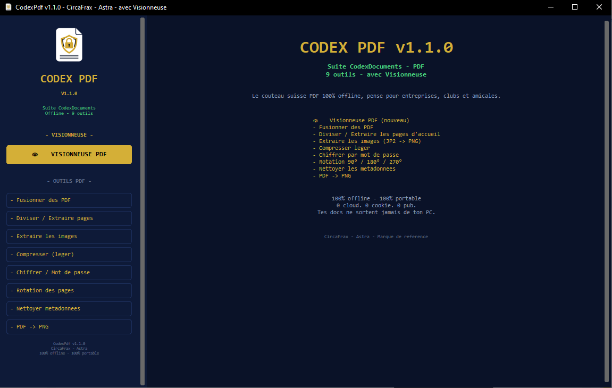

  

# CodexPdf v1.1.1 - Le couteau suisse PDF 100% offline

  

  
  
  
  
  

### ⬇️ [Télécharger CodexPdf v1.1.1 (Windows)](https://github.com/CircaFrax/CodexPdf/releases/download/v1.1.1/CodexPdf_v1.1.1.zip)

`SHA256: d19e82e2783e7e52123364951e47250658adc0b3f98eb9294e32f3cd6f271aa0`

---

### Pourquoi en offline ?

| Services en ligne | **CodexPdf** |
|---|---|
| Vos documents sont envoyés sur un serveur distant | **Vos PDF ne quittent jamais votre PC** |
| Cookies, publicités, limite de pages, compte obligatoire | **0 cookie, 0 pub, 0 compte, 0 limite** |
| Nécessite une connexion | **Fonctionne sans internet, même l'OCR** |
| Conditions d'utilisation floues sur vos données | **Confidentialité totale, vérifiable** |

> Conçu pour les documents sensibles : entreprises, associations, clubs, amicales.

## ✨ 10 outils en 1 exécutable

- **Visionneuse PDF** - navigation fluide, zoom molette, sans coupure (fix v1.1.1)
- **OCR - Image → Texte** - **NOUVEAU v1.1.1** - PDF scanné → PDF cherchable / txt, 100% offline avec Tesseract (`fra` + `eng`)
- **Fusionner** - assemble plusieurs PDF
- **Diviser / Extraire** - ex: extraire les pages 1-3
- **Extraire les images** - avec conversion auto pour formats pros
- **Compresser (léger)** - réduit sans perte visible
- **Rotation** - corrige les scans à l'envers 90°/180°/270°
- **Nettoyer métadonnées** - anonymise avant partage
- **Chiffrer par mot de passe**
- **PDF -> PNG** - pour partager sur mobile

## Aperçu

*Interface à deux panneaux – Menu à gauche, prévisualisation à droite - Nouveau module OCR en bas*

### 📁 Contenu du Zip
CodexPdf_v1.1.1/
├── CodexPdf_v1.1.1.exe
├── LICENSE.md
├── LICENCE.md
└──THIRD_PARTY_LICENSES.md

Pas d'installation. Double-clic et c'est parti, comme en 1998 mais en mieux. L'OCR fonctionne sans internet.

### 🔒 Confidentialité

- **Zéro réseau** : 100% offline, vérifiable au pare-feu, même l'OCR français
- **Zéro collecte** : n'écrit que les fichiers que vous demandez
- **100% légal & libre de droits** : Licence BSD-3-Clause CircaFrax + licences open-source permissives (MIT, BSD, Apache 2.0) incluses
- **Code source ouvert** : Fork possible, modifiable, redistribuable perso / asso / pro / commercial

### 📄 Licence

**BSD-3-Clause CircaFrax - Libre de droits**

Copyright (c) 2026 CircaFrax

Gratuit à vie, usage perso / associatif / pro / commercial. Vous pouvez modifier, partager, inclure dans une prestation. Il suffit de garder la mention CircaFrax.

Voir `LICENCE.md` et `THIRD_PARTY_LICENSES.md` inclus.

**Moteur OCR :** Tesseract OCR (Apache 2.0) via UB-Mannheim - https://github.com/UB-Mannheim/tesseract/wiki

---

**Fait partie de la suite Codex** — des outils offline CircaFrax.
**CircaFrax - Astra - Marque de référence**
