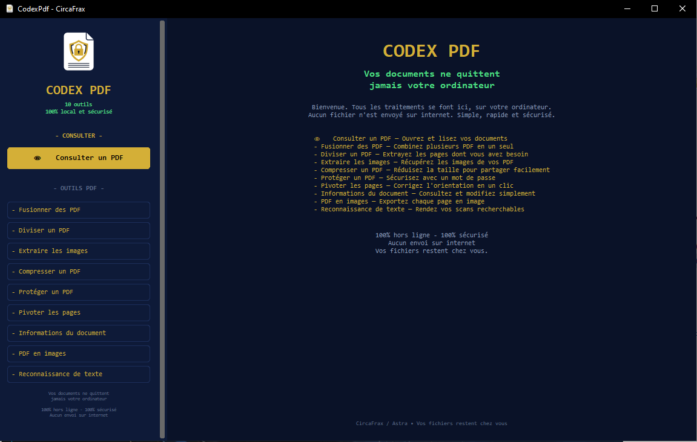

<p align="center">
  
</p>

# CodexPdf v1.1.1 - Le couteau suisse PDF 100% offline

<p align="center">
  
</p>

<p align="center">
  
  
  
  
  
</p>

<p align="center">

### ⬇️ [Télécharger CodexPdf v1.1.1](https://github.com/CircaFrax/CodexPdf/releases/download/v1.1.1/CodexPdf_v1.1.1.zip)

`SHA256: 021c1321b74f64e72acbcf62539f6f4ffcbc754175814432deecdefef9f64f1e`

</p>

---

### Pourquoi en offline ?

| Services en ligne | **CodexPdf** |
|---|---|
| Vos documents partent sur un serveur | **Vos PDF ne quittent jamais votre PC** |
| Cookies, pubs, limite | **0 cookie, 0 pub, 0 limite** |
| Besoin d'internet | **Fonctionne sans internet, même l'OCR** |

> Pour documents sensibles : entreprises, associations, clubs, amicales.

## ✨ 10 outils en 1 exécutable

- **Visionneuse** - fluide, zoom molette
- **OCR** - **NOUVEAU v1.1.1** - PDF scanné -> PDF cherchable / txt, 100% offline `fra+eng`
- **Fusionner, Diviser, Extraire images, Compresser, Rotation, Nettoyer métadonnées, Chiffrer, PDF->PNG**

## Aperçu

*Menu outils a gauche – interface a droite*

### 📁 Contenu du Zip


```
CodexPdf/
├── CodexPdf_v1.1.1.exe
├── LICENCE.md
├── LICENSE.md
└── THIRD_PARTY_LICENSES.md
```

Pas d'installation. Double-clic.

### 🔒 Confidentialité & Code Source

- **Zéro réseau** : 100% offline, même l'OCR
- **Code source privé** : Reste propriété exclusive CircaFrax pour protéger la suite Codex et éviter les failles
- **Binaire libre de droits** : Exe sous BSD-3-Clause CircaFrax - gratuit à vie perso/asso/pro/commercial
- **100% légal** : 【entity-Tesseract¦canonical_name=Tesseract】 Apache 2.0 + libs MIT/BSD

### 📄 Licence

**Source : Privé - Tous droits réservés CircaFrax**
**Binaire : BSD-3-Clause CircaFrax - Libre de droits**

Gratuit à vie. Redistribution libre de l'exe à l'identique avec ses licences. Voir `LICENCE.md`.

---
**Suite Codex - Outils offline CircaFrax**
